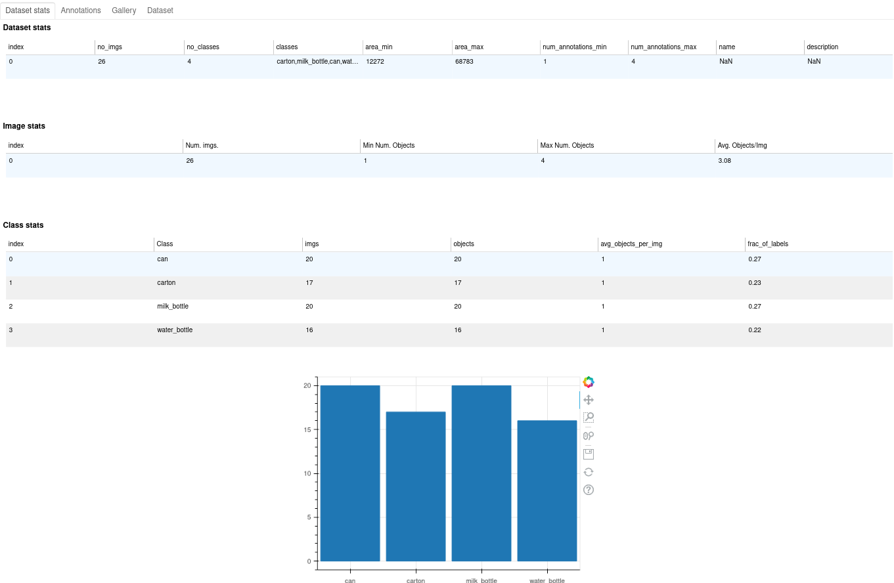
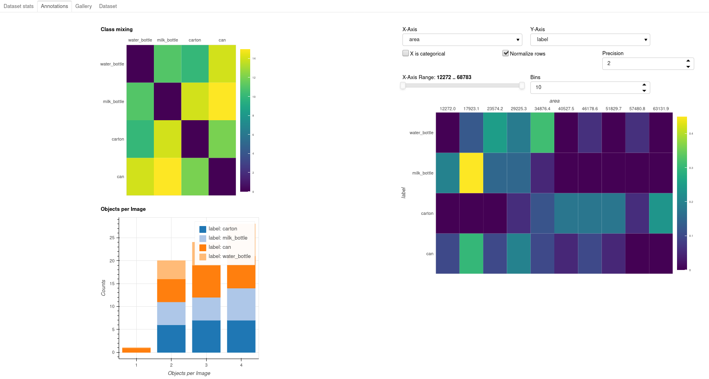
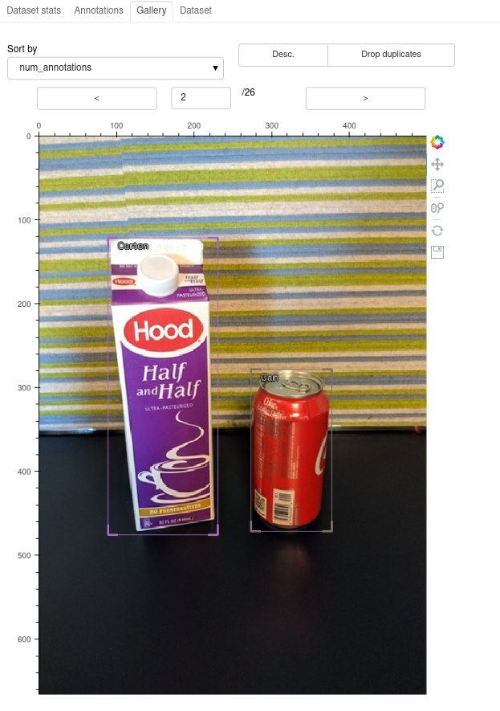
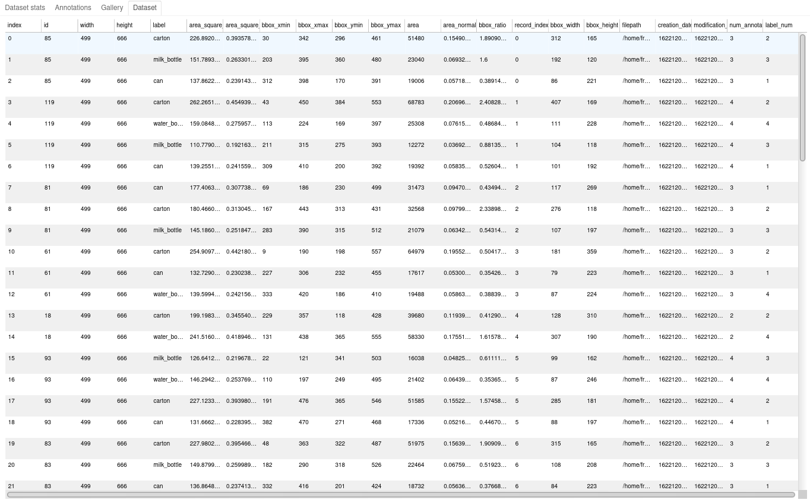

# IceVisionDashboard


IceVisionDashboard is an extension to the [IceVision](https://github.com/airctic/icevision) object detection framework. This extension provides different `dashboards` to investigate datasets, create new datasets and analyse the results of a training.

The libary provides dashboards to inspect datasets, create new datasets, investigate the results of a training and much more.

## Examples

```python
from icevision_dashboards.data import BboxRecordDataset
from icevision_dashboards.dashboards import ObjectDetectionDatasetOverview

# load some data from the icedata
data_dir = icedata.fridge.load_data()
class_map = icedata.fridge.class_map()
parser = icedata.fridge.parser(data_dir)
train_records, valid_records = test_parser.parse()

# create a dataset that can be consumed by the dashboards
train_dash_ds = BboxRecordDataset(train_records, class_map)

# create a new dashboard instance and display it with the .show() function
overview_dashboard = ObjectDetectionDatasetOverview(train_dash_ds, width=1500, height=900)
overview_dashboard.show()
```

The output will look like this:



<div style="text-align:center"></div>



## Contributing

If you want to contribute add the following lines to your `pre-commit` file to ensure the notebook cell output don't get pushed into the repo.

```bash
# ensure the oupt of the notebooks is empty
jupyter nbconvert --ClearOutputPreprocessor.enabled=True --inplace nbs/*.ipynb
git add .
```
